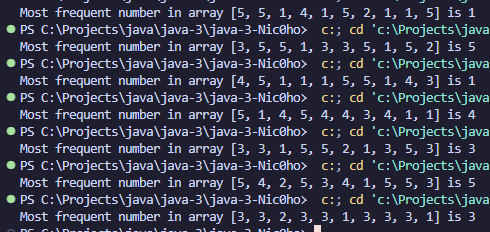

[](https://classroom.github.com/open-in-codespaces?assignment_repo_id=23821853)

# Практична робота "Масиви, вирази, керування виконанням програми" - Єдалов Артем 35 група


## В рамках практичної роботи зробив наступне:
1. модифікувати стартовий код таким чином, щоб метод ```Calculate``` класу ```Exercise``` містив код обчислення значення у відповідності до обраного завдання ```(Знайти в масиві число, яке повторюється найбільшу кількість разів)```

### РЕЗУЛЬТАТ:
```java
package domain;

import java.util.Arrays;

/**
 * Клас для виконання обчислювальних операцій з масивами.
 */
public class Exercise
{
    /**
     * Метод шукає число, яке найчастіше зустрічається в масиві.
     * Спочатку масив сортується а потім знаходиться найдовший інтервал повторюваних чисел.
     * @param array вхідний одновимірний масив цілих чисел.
     * @return число, що повторюється найбільшу кількість разів
     */
    public static int Calculate(int[] array)
    {
        if (array == null || array.length == 0) return 0;

        Arrays.sort(array);

        int maxCount = 0;
        int mostFrequent = array[0];

        for (int i = 0; i < array.length; i++)
        {
            int currentCount = 1;
            
            while (i + 1 < array.length && array[i] == array[i + 1])
            {
                currentCount++;
                i++;
            }
            
            if (currentCount > maxCount)
            {
                maxCount = currentCount;
                mostFrequent = array[i];
            }
        }

        return mostFrequent;
    }
}
```

2. рядок, який виводиться у результаті виконання методу ```main``` класу ```TestResult``` теж відкоригований у відповідності до специфіки завдання

### РЕЗУЛЬТАТ:
```java
package test;

import domain.Exercise;
import java.util.Arrays;

public class TestResult {

    public static void main(String[] args) {

        int[] array = new int[10];

        for (int i = 0; i < array.length; i++)
        { array[i] = (int) (Math.random() * 5) + 1; }

        System.out.println("Most frequent number in array " + Arrays.toString(array) + " is " + Exercise.Calculate(array));
    }
}
```

## Приклад тестування методу:

